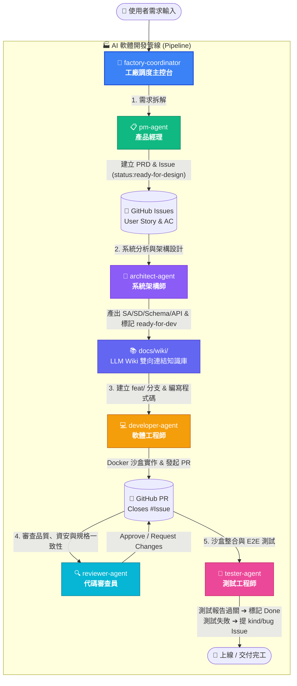

# 🏭 AI Software Factory & LLM Wiki (AI 軟體開發工廠與知識庫)

[](https://github.com/wujj1114/my-ai-factory)
[](https://modelcontextprotocol.io)
[](./目錄.md)
[](./scripts/audit_wiki_consistency.py)
[](LICENSE)

> 基於 **Subagents 多智能體協作**、**Model Context Protocol (MCP)** 與 **Obsidian LLM Wiki 知識庫** 打造的自動化軟體工程工廠。從需求分析、架構規劃、Schema/API 定義、代碼編寫、審查到測試，全流程與 GitHub 生態系無縫串接。

---

## ⚡ 快速導覽與快捷連結

| 連結目標 | 說明 | 快捷跳轉 |
| :--- | :--- | :--- |
| 📚 **LLM Wiki 總目錄** | 知識庫 MOC 地圖，支援 Obsidian 雙向網狀拓樸檢索 | [📖 檢視 目錄.md](./目錄.md) |
| 📜 **專案演進日誌** | 追蹤架構、規格與 Schema 每次異動歷史 | [📜 檢視 日誌.md](./日誌.md) |
| 📋 **Issue 追蹤看板** | 查看所有正在進行與規劃中的需求任務 | [前往 GitHub Issues](https://github.com/wujj1114/my-ai-factory/issues) |
| 🔀 **Pull Requests 審查** | 檢視 Developer 提交與 Reviewer 審查中的 PR | [前往 GitHub PRs](https://github.com/wujj1114/my-ai-factory/pulls) |
| 🤖 **Agent 規範手冊** | 全域 Agent 與知識庫最高執行準則 | [檢視 AGENTS.md](./AGENTS.md) |

---

## 🧭 軟體工廠運作流程架構

本專案採用專業軟體團隊角色分工，各 Agent 透過 GitHub Issue、PR 與沙盒環境實現自動化交付流水線：



---

## 📚 LLM Wiki 知識庫體系結構

本專案將軟體工程資產以 **Obsidian Vault** 規範進行雙向網狀拓樸管理：

```text
docs/wiki/
├── 01_使用者需求與PRD/       # User Stories, AC, 需求規格書
├── 02_系統分析SA/           # 業務流程圖 (Flowchart), 狀態機 (State Machine)
├── 03_系統設計SD/           # 模組架構, 循序圖 (Sequence Diagram)
├── 04_資料庫設計與Schema/   # 資料表字典 (Data Dictionary), PostgreSQL DDL
├── 05_API規格與介接/         # RESTful/GraphQL 端點規格, Request/Response JSON
├── 06_架構決策ADR/          # 架構決策紀錄 (ADR-001 ~ )
└── 07_測試與驗收/           # 整合測試矩陣, QA 查核點
```

> 💡 **零死鏈保證**：執行 `python -X utf8 scripts/audit_wiki_consistency.py` 自動稽核知識庫 100% 完整度與雙向連結拓樸。

---

## 👥 Subagents 角色與職責定義

| 角色名稱 | 檔案路徑 | 核心職責與產出 | 使用工具 |
| :--- | :--- | :--- | :--- |
| **Coordinator** | [.agents/factory-coordinator.md](./.agents/factory-coordinator.md) | 工廠總指揮，協調整個開發流程的依序調度與狀態流轉 | `run_subagent`, `github_mcp` |
| **PM** | [.agents/pm-agent.md](./.agents/pm-agent.md) | 解析需求，建立包含 Context、AC 的 GitHub Feature Issue 與 `01_PRD` | `github_mcp` |
| **Architect** | [.agents/architect-agent.md](./.agents/architect-agent.md) | 撰寫系統架構、SA/SD、Schema 與 API 規格，維護 `docs/wiki/` | `github_mcp` |
| **Developer** | [.agents/developer-agent.md](./.agents/developer-agent.md) | 於 Docker 沙盒內開闢 `feat/` 分支、編寫代碼與單元測試、提 PR | `openhands_sandbox_exec`, `git_tools` |
| **Reviewer** | [.agents/reviewer-agent.md](./.agents/reviewer-agent.md) | 審查 PR 變更，把關代碼品質、規格一致性 (Doc-Code Sync) 與資安 | `github_mcp` |
| **Tester** | [.agents/tester-agent.md](./.agents/tester-agent.md) | 執行沙盒端到端 (E2E) 與 API 測試，出具測試報告或建立 Bug Issue | `openhands_sandbox_exec`, `github_mcp` |

---

## 🏷️ GitHub 標籤生命週期 (Lifecycle)

整個工廠依賴 GitHub 標籤與狀態進行自動流轉：

```text
[新需求] 
  ➔ kind/feature + status:ready-for-design  (PM Agent 建立)
  ➔ status:ready-for-dev                     (Architect Agent 產出架構後標記)
  ➔ In Progress / Branch: feat/issue-<id>    (Developer Agent 開發中)
  ➔ In Review / Pull Request                 (Reviewer Agent 審查)
  ➔ In QA / Test Passed                      (Tester Agent 驗證)
  ➔ Closed / Merged 🎉                       (完成交付)
```

---

## 🚀 如何在你的新專案中使用本架構？

### 方式 1：使用 GitHub Template 範本（推薦）
1. 在本儲存庫頁面右上角點擊 **「Use this template」** ➔ **「Create a new repository」**。
2. 輸入你的新專案名稱並建立，即刻獲得整套架構骨架！

### 方式 2：使用 `degit` 命令列一鍵下載
在終端機執行下列指令，即可在 3 秒內取得乾淨、無 Git 歷史的專案骨架：
```bash
npx degit wujj1114/my-ai-factory my-new-app
cd my-new-app
```

---

## ⚙️ 環境配置與 MCP 連線設定

1. **複製 MCP 設定檔：**
   ```bash
   cp .antigravity/mcp_servers.example.json .antigravity/mcp_servers.json
   ```
2. **填入 GitHub Personal Access Token：**
   編輯 `.antigravity/mcp_servers.json`，將你的 Token 填入：
   ```json
   {
     "mcpServers": {
       "github": {
         "command": "npx",
         "args": ["-y", "@modelcontextprotocol/server-github"],
         "env": {
           "GITHUB_PERSONAL_ACCESS_TOKEN": "ghp_yourPersonalAccessTokenHere"
         }
       }
     }
   }
   ```
3. **驗證連線與執行 Wiki 稽核：**
   ```bash
   # 執行 Wiki 一致性與雙向連結稽核
   python -X utf8 scripts/audit_wiki_consistency.py
   ```

---

## 📂 專案目錄結構

```text
my-ai-factory/
├── .agents/                        # 各 Subagent 提示詞與行為規則
│   ├── factory-coordinator.md      # 工廠調度器
│   ├── pm-agent.md                 # 產品經理
│   ├── architect-agent.md          # 系統架構師
│   ├── developer-agent.md          # 軟體開發者
│   ├── reviewer-agent.md           # 代碼審查員
│   └── tester-agent.md             # 測試工程師
├── .antigravity/                   # MCP 伺服器配置目錄
│   ├── mcp_servers.example.json    # 設定檔範本（公開）
│   └── mcp_servers.json            # 實際運作設定檔（已加入 .gitignore）
├── raw_specs/                      # 原始客戶文件 (Word, Excel, PDF, DDL, 會議紀錄)
├── docs/                           # 規格文件庫
│   ├── architecture/               # 系統總架構圖
│   └── wiki/                       # LLM Wiki 知識庫 (Obsidian Vault)
│       ├── 01_使用者需求與PRD/
│       ├── 02_系統分析SA/
│       ├── 03_系統設計SD/
│       ├── 04_資料庫設計與Schema/
│       ├── 05_API規格與介接/
│       ├── 06_架構決策ADR/
│       └── 07_測試與驗收/
├── scripts/                        # 自動化維護與一致性稽核腳本
│   ├── audit_wiki_consistency.py   # Wiki 完整度與雙向連結稽核
│   └── normalize_links.py          # Obsidian 雙向連結正規化工具
├── src/                            # 應用程式原始碼
├── tests/                          # 單元測試與 E2E 測試
├── AGENTS.md                       # 全域多 Agent 與 Wiki 運作最高準則
├── CLAUDE.md                       # AI 助理快速參照指引
├── 目錄.md                         # 知識庫總目錄 (Map of Content, MOC)
├── 日誌.md                         # 規格與開發變更日誌 (Dev Changelog)
├── .gitignore                      # Git 忽略清單
└── README.md                       # 專案說明與架構導覽
```
