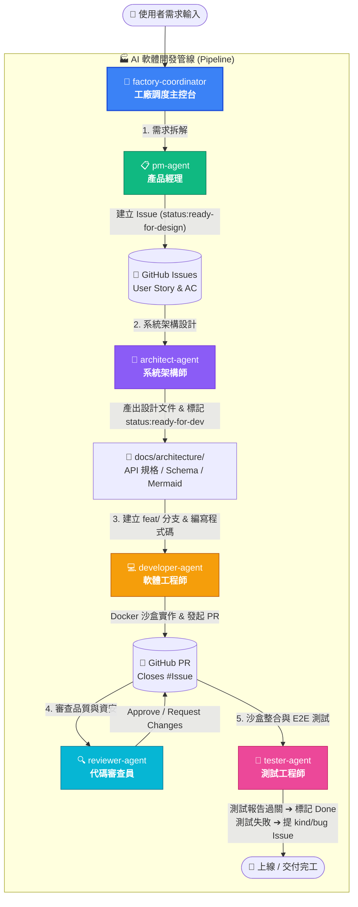

# 🏭 AI Software Factory (AI 軟體開發工廠)

[](https://github.com/wujj1114/my-ai-factory)
[](https://modelcontextprotocol.io)
[](#-軟體工廠運作流程架構)
[](LICENSE)

> 基於 **Subagents 多智能體協作** 與 **Model Context Protocol (MCP)** 打造的自動化軟體工程工廠。從需求分析、架構規劃、代碼編寫、審查到測試，全流程與 GitHub 生態系無縫串接。

---

## ⚡ 快速導覽與快捷連結

| 連結目標 | 說明 | 快捷跳轉 |
| :--- | :--- | :--- |
| 📋 **Issue 追蹤看板** | 查看所有正在進行與規劃中的需求任務 | [前往 GitHub Issues](https://github.com/wujj1114/my-ai-factory/issues) |
| 🔀 **Pull Requests 審查** | 檢視 Developer 提交與 Reviewer 審查中的 PR | [前往 GitHub PRs](https://github.com/wujj1114/my-ai-factory/pulls) |
| 📐 **系統架構規範庫** | 存放 Architect 產出的 Mermaid 圖與 API 規範 | [瀏覽 docs/architecture/](./docs/architecture/) |
| 🤖 **Agent 提示詞定義** | 檢視與調整各角色 Subagent 運作指令 | [瀏覽 .agents/](./.agents/) |

---

## 🧭 軟體工廠運作流程架構

本專案採用專業軟體團隊角色分工，各 Agent 透過 GitHub Issue、PR 與沙盒環境實現自動化交付流水線：



---

## 👥 Subagents 角色與職責定義

| 角色名稱 | 檔案路徑 | 核心職責與產出 | 使用工具 |
| :--- | :--- | :--- | :--- |
| **Coordinator** | [.agents/factory-coordinator.md](./.agents/factory-coordinator.md) | 工廠總指揮，協調整個開發流程的依序調度與狀態流轉 | `run_subagent`, `github_mcp` |
| **PM** | [.agents/pm-agent.md](./.agents/pm-agent.md) | 解析需求，建立包含 Context、AC 的 GitHub Feature Issue | `github_mcp` |
| **Architect** | [.agents/architect-agent.md](./.agents/architect-agent.md) | 技術選型、撰寫系統架構圖與 API 介面規格，更新 Issue 狀態 | `github_mcp` |
| **Developer** | [.agents/developer-agent.md](./.agents/developer-agent.md) | 於 Docker 沙盒內開闢 `feat/` 分支、編寫代碼與單元測試、提 PR | `openhands_sandbox_exec`, `git_tools` |
| **Reviewer** | [.agents/reviewer-agent.md](./.agents/reviewer-agent.md) | 審查 PR 變更，把關代碼品質、架構符合度與安全性漏洞 | `github_mcp` |
| **Tester** | [.agents/tester-agent.md](./.agents/tester-agent.md) | 執行沙盒端到端 (E2E) 與 API 測試，出具測試報告或建立 Bug Issue | `openhands_sandbox_exec`, `github_mcp` |

---

## 🏷️ GitHub 標籤生命週期 (Lifecycle)

整個工廠依賴 GitHub 標籤與狀態進行自動流轉：

```text
[新需求] 
  ➔ kind/feature + status:ready-for-design  (PM Agent 建立)
  ➔ status:ready-for-dev                     (Architect Agent 產出架構後標記)
  ➔ In Progress / Branch: feat/issue-<id>    (Developer Agent 開發中)
  ➔ In Review / Pull Request                 (Reviewer Agent 審查)
  ➔ In QA / Test Passed                      (Tester Agent 驗證)
  ➔ Closed / Merged 🎉                       (完成交付)
```

---

## 🚀 如何在你的新專案中使用本架構？

### 方式 1：使用 GitHub Template 範本（推薦）
1. 在本儲存庫頁面右上角點擊 **「Use this template」** ➔ **「Create a new repository」**。
2. 輸入你的新專案名稱並建立，即刻獲得整套架構骨架！

### 方式 2：使用 `degit` 命令列一鍵下載
在終端機執行下列指令，即可在 3 秒內取得乾淨、無 Git 歷史的專案骨架：
```bash
npx degit wujj1114/my-ai-factory my-new-app
cd my-new-app
```

---

## ⚙️ 環境配置與 MCP 連線設定

1. **複製 MCP 設定檔：**
   ```bash
   cp .antigravity/mcp_servers.example.json .antigravity/mcp_servers.json
   ```
2. **填入 GitHub Personal Access Token：**
   編輯 `.antigravity/mcp_servers.json`，將你的 Token 填入：
   ```json
   {
     "mcpServers": {
       "github": {
         "command": "npx",
         "args": ["-y", "@modelcontextprotocol/server-github"],
         "env": {
           "GITHUB_PERSONAL_ACCESS_TOKEN": "ghp_yourPersonalAccessTokenHere"
         }
       }
     }
   }
   ```
3. **驗證連線：**
   確保本機具備 Node.js 環境（建議 v20+），即可透過 Stdio 自動與 GitHub MCP 服務握手。

---

## 📂 專案目錄結構

```text
my-ai-factory/
├── .agents/                        # 各 Subagent 提示詞與行為規則
│   ├── factory-coordinator.md      # 工廠調度器
│   ├── pm-agent.md                 # 產品經理
│   ├── architect-agent.md          # 系統架構師
│   ├── developer-agent.md          # 軟體開發者
│   ├── reviewer-agent.md           # 代碼審查員
│   └── tester-agent.md             # 測試工程師
├── .antigravity/                   # MCP 伺服器配置目錄
│   ├── mcp_servers.example.json    # 設定檔範本（公開）
│   └── mcp_servers.json            # 實際運作設定檔（已加入 .gitignore）
├── docker/                         # Docker 沙盒環境配置
├── docs/                           # 規格文件庫
│   └── architecture/               # 架構設計文件 (API / Mermaid / Schema)
├── src/                            # 應用程式原始碼
├── tests/                          # 單元測試與 E2E 測試
├── .gitignore                      # Git 忽略清單
└── README.md                       # 專案說明與架構導覽
```

---

## 🔮 未來功能擴充路線 (Roadmap)

- [ ] **GitHub Projects 自動化 Kanban 看板連動**
- [ ] **CI/CD 自動化 Pipeline (GitHub Actions) 串接**
- [ ] **自動化 CHANGELOG 與 Release 釋出 Agent**
- [ ] **多語言技術棧範本支援 (Python FastAPI, Go, Next.js, Node.js)**
