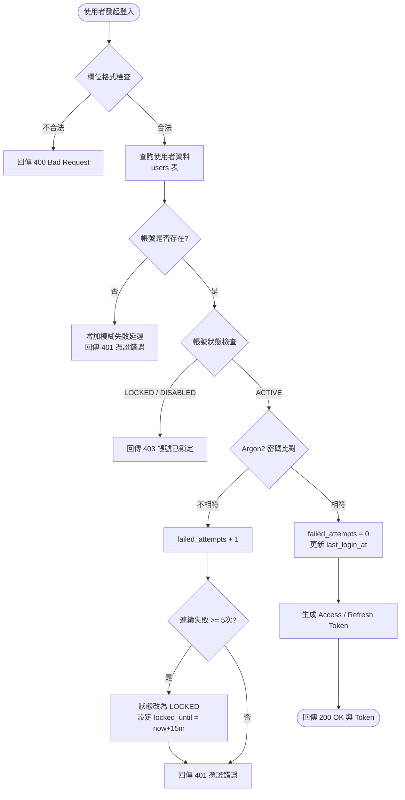
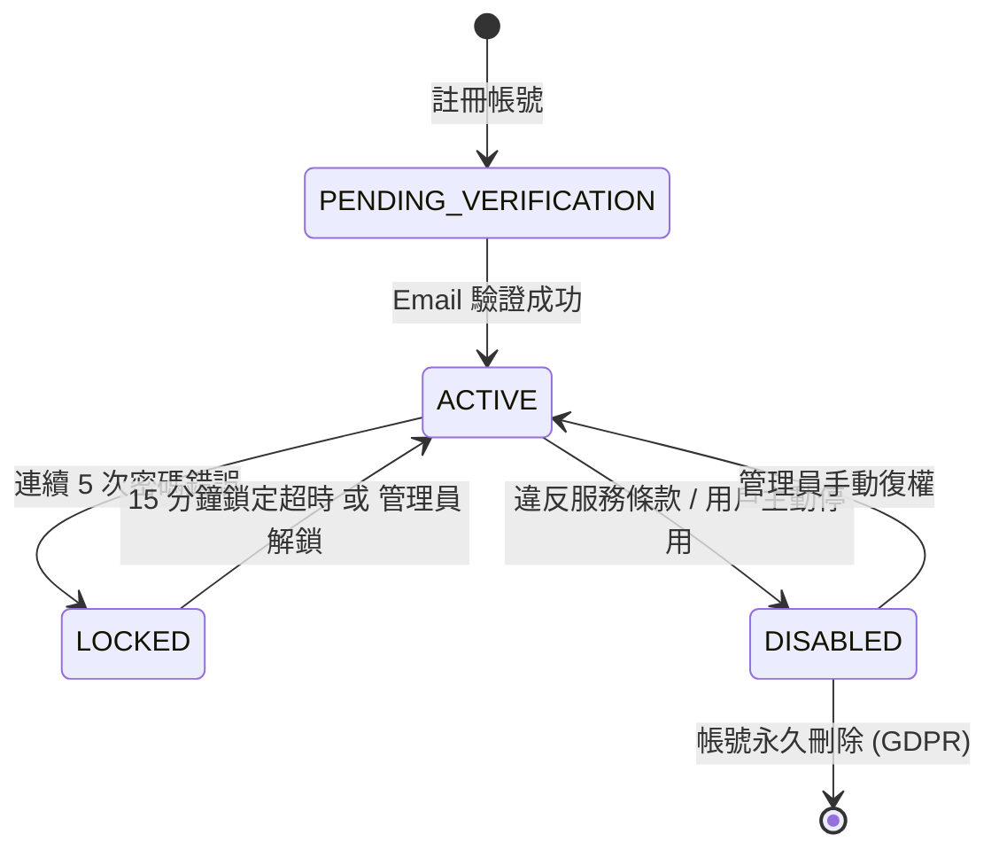

# SA-001: 會員登入業務流程與狀態機分析

## 📊 業務流程圖 (Business Flowchart)

---

## 🔄 帳號狀態機 (User Account State Machine)

---

## 📋 業務規則清單 (Business Rules)

| 規則代碼 | 規則名稱 | 詳細描述 |
| :--- | :--- | :--- |
| **BR-AUTH-01** | 密碼雜湊防護 | 密碼儲存一律採用 **Argon2id** 演算法，禁止以明文或 MD5/SHA1 儲存。 |
| **BR-AUTH-02** | 帳號枚舉防護 | 不論是帳號不存在或密碼錯誤，一律回傳統一錯誤碼 `AUTH_INVALID_CREDENTIALS`，防範枚舉攻擊。 |
| **BR-AUTH-03** | 失敗次數歸零 | 只要有一次登入成功，立即將 `failed_login_attempts` 重設為 0。 |
| **BR-AUTH-04** | 雙 Token 輪轉 | Access Token (15 分鐘) 無狀態，Refresh Token (7 天) 採白名單/版本號控制。 |

---

## 🔗 雙向關聯拓樸 (Bi-directional Links)
* 上游需求規格：[[docs/wiki/01_使用者需求與PRD/REQ-001_會員登入與身份驗證|REQ-001 會員登入與身份驗證]]
* 下游系統設計：[[docs/wiki/03_系統設計SD/SD-001_JWT認證與Token刷新機制|SD-001 JWT 認證與 Token 刷新機制]]
* 關聯資料庫：[[docs/wiki/04_資料庫設計與Schema/users表|users 表]]
* 關聯 API 端點：[[docs/wiki/05_API規格與介接/POST_api_v1_auth_login|POST /api/v1/auth/login]]
* 關聯測試計畫：[[docs/wiki/07_測試與驗收/TEST-001_會員登入模組測試計畫|TEST-001 會員登入模組測試計畫]]
