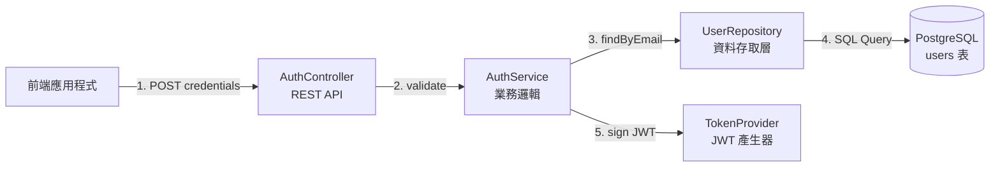
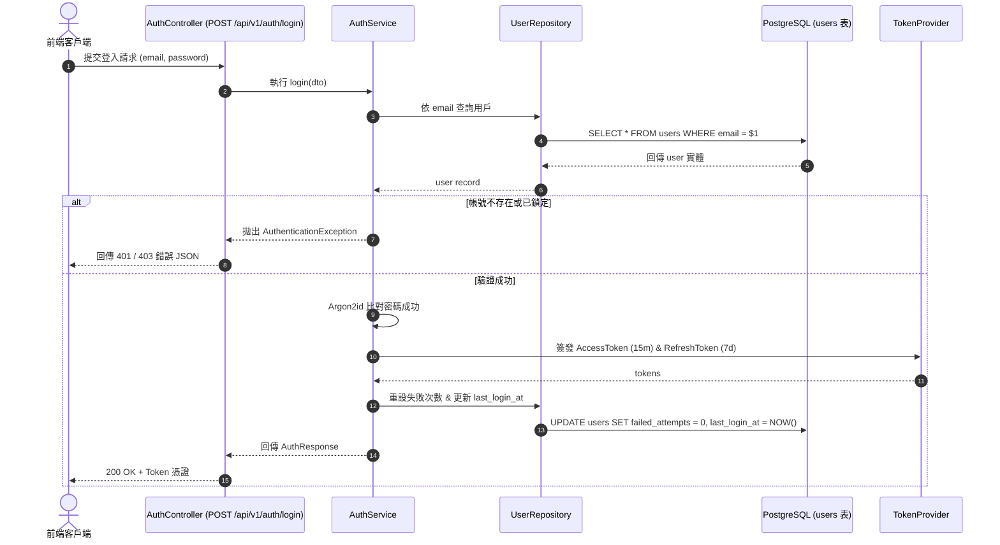

# SD-001: JWT 認證與 Token 刷新機制系統設計

## 📐 模組架構與元件責任 (Component Architecture)



---

## 🔁 登入時序圖 (Sequence Diagram)



---

## 🔒 安全性設計細節 (Security Specifications)

1. **Access Token Payload**：
   ```json
   {
     "sub": "usr_9b1deb4d-3b7d-4bad-9bdd-2b0d7b3dcb6d",
     "email": "user@example.com",
     "role": "USER",
     "token_version": 1,
     "iat": 1788072000,
     "exp": 1788072900
   }
   ```
2. **簽名演算法**：採用 **Ed25519 (EdDSA)** 或 **RS256** 非對稱金鑰簽名。
3. **儲存規範**：前端 Refresh Token 必須存放於 `HttpOnly`, `Secure`, `SameSite=Strict` 之 Cookie 中。

---

## 🔗 雙向關聯拓樸 (Bi-directional Links)
* 上游需求：[[docs/wiki/01_使用者需求與PRD/REQ-001_會員登入與身份驗證|REQ-001 會員登入與身份驗證]]
* 上游系統分析：[[docs/wiki/02_系統分析SA/SA-001_會員登入業務流程與狀態機|SA-001 會員登入業務流程與狀態機]]
* 關聯資料庫 Schema：[[docs/wiki/04_資料庫設計與Schema/users表|users 表]]
* 實作 API 規格：[[docs/wiki/05_API規格與介接/POST_api_v1_auth_login|POST /api/v1/auth/login]]
* 關聯架構決策：[[docs/wiki/06_架構決策ADR/ADR-001_關聯式資料庫選用PostgreSQL|ADR-001 關聯式資料庫選用 PostgreSQL]]
* 關聯測試計畫：[[docs/wiki/07_測試與驗收/TEST-001_會員登入模組測試計畫|TEST-001 會員登入模組測試計畫]]
