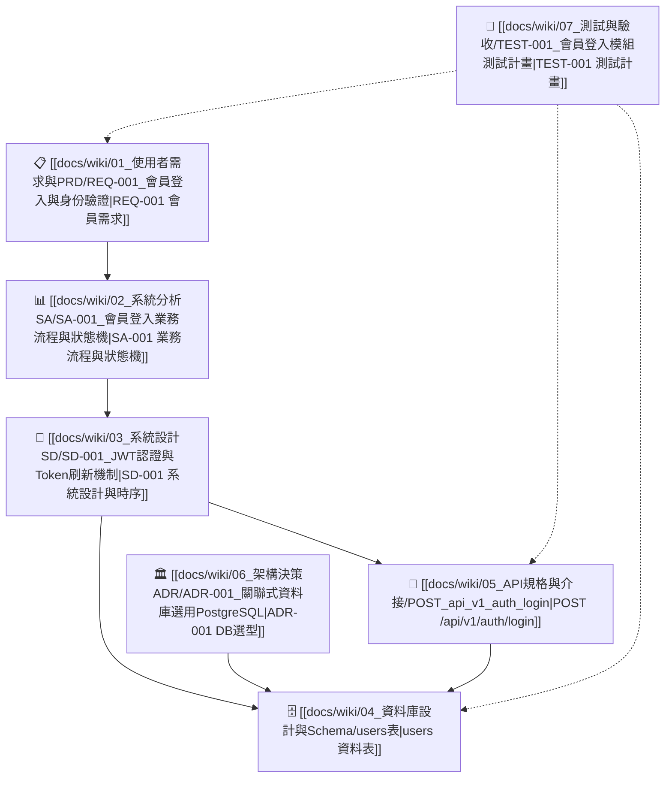

# 📚 LLM Wiki 知識庫總目錄 (Map of Content, MOC)

> 本目錄為本專案軟體架構、需求與系統規格之總索引。支援 **Obsidian** 網狀圖譜檢索，各章節實體均透過 `[[雙向連結]]` 互相串聯。

---

## 🧭 知識庫分類導覽

### 1. 📋 使用者需求與 PRD (`01_使用者需求與PRD/`)
* [[docs/wiki/01_使用者需求與PRD/REQ-001_會員登入與身份驗證|REQ-001: 會員登入與身份驗證]] — 定義 User Stories (US-01, US-02) 與驗收條件 (AC-1 ~ AC-4)。

### 2. 📊 系統分析 SA (`02_系統分析SA/`)
* [[docs/wiki/02_系統分析SA/SA-001_會員登入業務流程與狀態機|SA-001: 會員登入業務流程與狀態機]] — 包含登入判斷 Mermaid Flowchart、帳號生命週期狀態機與 4 大業務規則。

### 3. 📐 系統設計 SD (`03_系統設計SD/`)
* [[docs/wiki/03_系統設計SD/SD-001_JWT認證與Token刷新機制|SD-001: JWT 認證與 Token 刷新機制]] — 元件架構責任、登入驗證時序圖 (Sequence Diagram) 與安全規範。

### 4. 🗄️ 資料庫設計與 Schema (`04_資料庫設計與Schema/`)
* [[docs/wiki/04_資料庫設計與Schema/users表|users: 使用者資料表]] — 完整欄位字典、資料型態、PostgreSQL 實體 DDL 與索引規劃。

### 5. 🔌 API 規格與介接 (`05_API規格與介接/`)
* [[docs/wiki/05_API規格與介接/POST_api_v1_auth_login|POST /api/v1/auth/login]] — 會員登入端點 Request/Response Schema、JSON 範例與錯誤代碼表。

### 6. 🏛️ 架構決策 ADR (`06_架構決策ADR/`)
* [[docs/wiki/06_架構決策ADR/ADR-001_關聯式資料庫選用PostgreSQL|ADR-001: 關聯式資料庫選用 PostgreSQL]] — 紀錄關聯式資料庫選型考量、驅動因素與利弊評估。

### 7. 🧪 測試與驗收 (`07_測試與驗收/`)
* [[docs/wiki/07_測試與驗收/TEST-001_會員登入模組測試計畫|TEST-001: 會員登入模組測試計畫]] — 整合測試案例矩陣 (TC-AUTH-01 ~ TC-AUTH-06) 與執行查核點。

---

## 🔗 核心模組全拓樸地圖 (Module Topologies)

### 🔐 會員認證模組 (Authentication Module)

---

## 🛠️ 維護與一致性稽核
* 稽核腳本：`scripts/audit_wiki_consistency.py`
* 執行指令：`python -X utf8 scripts/audit_wiki_consistency.py`
* 變更紀錄：[[日誌.md|專案演進日誌]]
